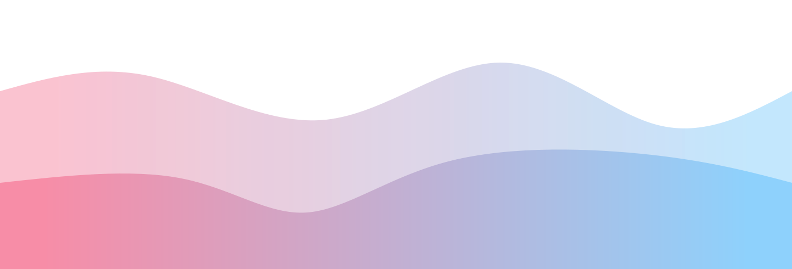

## Hi there 👋

- 📖 I'm an undergraduate computer science student
- 🔭 a part-time Bibliophile📕 and Wayfarer🚶
- 🌱 I'm currently learning Computer Science
- 👯 I look forward to collaborating on OSS projects that I like!
- 📧 How to reach me: [here](mailto:qyxtim02@gmail.com)
- 😄 Pronouns: He/Him/His

I joined Github **4** years ago. Since then I pushed **1264** commits, opened **19** issues, submitted **31** pull requests, received **236** stars across **12** personal projects and contributed to **10** public repositories.

### Languages across my projects

